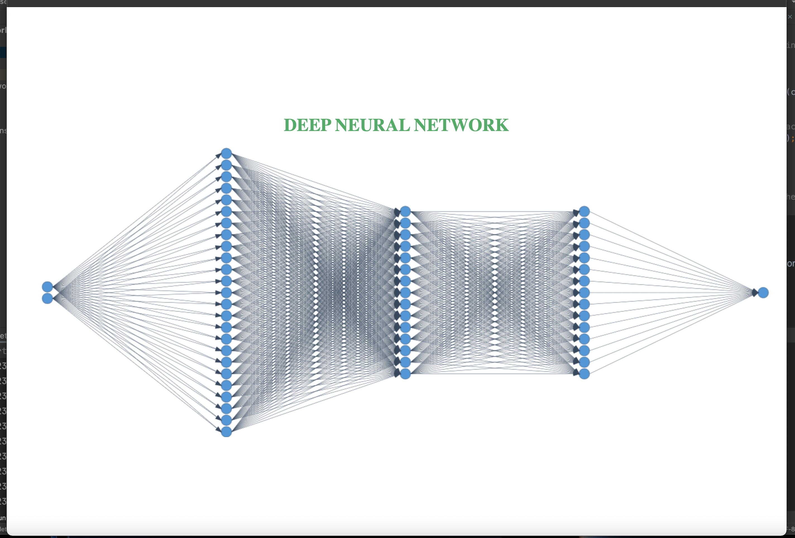

## Multi Layered Neural Network Built in Java
This is a Multi Layered Neural Network Library made in java for experimental purposes in January-March 2020. Let's peek into the code
```java
      // MultiLayerConfiguration for Neural Network Structure
final MultiLayerConfiguration config = new MultiLayerConfiguration.Builder()
                .activation(ActivationFunction.LEAKY_RELU)
                .weightInit(WeightInit.XAVIER)
                .optimizationAlgo(OptimizationAlgo.STOCHASTIC_GRADIENT_DESCENT) // Change SGD or GD
                .momentum(0.5)
                .updater(0.001) // learning rate or updater
                .layer(0, new InputLayer.Builder().nIn(2) // InputSize fanInput
                        .build())
                .layer(1, new DenseLayer.Builder().nIn(25) // DenseLayer 
                        .activation(ActivationFunction.LEAKY_RELU)
                        .build())
                .layer(2, new DenseLayer.Builder().nIn(15) // DenseLayer
                        .activation(ActivationFunction.LEAKY_RELU)
                        .build())
                .layer(3, new DenseLayer.Builder().nIn(15) // DenseLayer
                        .activation(ActivationFunction.LEAKY_RELU)
                        .build())
                .layer(4, new OutputLayer.Builder().nOut(1) // OutputSize fanout
                        .activation(ActivationFunction.LEAKY_RELU)
                        .build())
                .list()
                .minError(0.01)
                .server(true) // port 8080 for visualizing the network
                .build();
        
        // MultiLayer Network Builder
        MultiLayerNetwork model = new MultiLayerNetwork(config);
        model.init();
        
        // If you want to see the score then this callback will give the result
        ScoreListener listener = new ScoreListener(1000);
        model.addScoreListener(listener);
        
        model.fit(xor); // for training the network

        double[] p1 = model.predict(1, 1); // predict the input values that you have trained
```
### Removed
* Removed The ScalarNormalization and CSVParser for custom implementation.
* Removed Gradient Cliping Unstable Performance.

### Vizulization of Multi Layered Network


## Dependency Maven
```xml
<!-- For Repository Pulling -->
<repositories>
    <repository>
        <id>jitpack.io</id>
        <url>https://jitpack.io</url>
    </repository>
</repositories>
<!-- For Dependencies -->
<dependencies>
    <dependency>
        <groupId>com.github.zaxxio</groupId>
        <artifactId>Layered-Neural-Network</artifactId>
        <version>v1.0.4</version>
    </dependency>
</dependencies>
```
## Dependency Gradle
```groovy
allprojects {
    repositories {
        // jcenter or mavenCentral something 
        maven { url 'https://jitpack.io' }
    }
}
dependencies {
    implementation 'com.github.zaxxio:Layered-Neural-Network:v1.0.4'
}
```

Thank you.
### MIT Licence
```text
Copyright 2022 Partha Sutradhar

Permission is hereby granted, free of charge, to any person obtaining a copy of this software and associated documentation files (the "Software"), to deal in the Software without restriction, including without limitation the rights to use, copy, modify, merge, publish, distribute, sublicense, and/or sell copies of the Software, and to permit persons to whom the Software is furnished to do so, subject to the following conditions:

The above copyright notice and this permission notice shall be included in all copies or substantial portions of the Software.

THE SOFTWARE IS PROVIDED "AS IS", WITHOUT WARRANTY OF ANY KIND, EXPRESS OR IMPLIED, INCLUDING BUT NOT LIMITED TO THE WARRANTIES OF MERCHANTABILITY, FITNESS FOR A PARTICULAR PURPOSE AND NONINFRINGEMENT. IN NO EVENT SHALL THE AUTHORS OR COPYRIGHT HOLDERS BE LIABLE FOR ANY CLAIM, DAMAGES OR OTHER LIABILITY, WHETHER IN AN ACTION OF CONTRACT, TORT OR OTHERWISE, ARISING FROM, OUT OF OR IN CONNECTION WITH THE SOFTWARE OR THE USE OR OTHER DEALINGS IN THE SOFTWARE.
```
